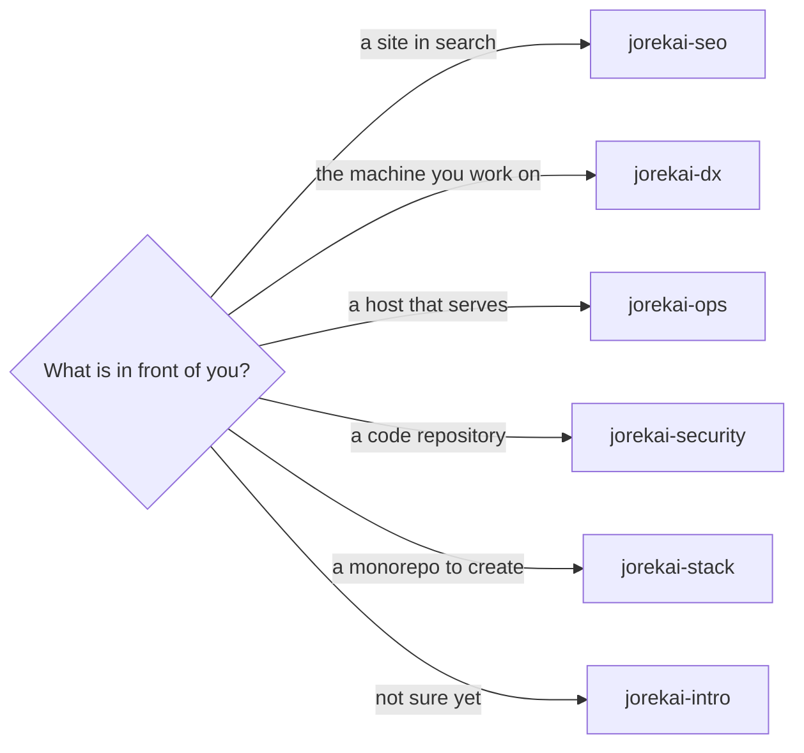
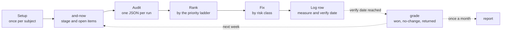

# skills

Hand-maintained skills for recurring work, one Claude Code plugin per theme. Install once, then the skills are slash commands in every repository.

This page is the entry point. It helps you pick a theme and shows what every theme shares. Each theme has its own page with its loop, its skills, and its workspace.

## Pick a theme

Start from what is in front of you:



| Theme | What it covers | Start with |
|---|---|---|
| [SEO](skills/seo/README.md) | One site in search: indexing, what almost ranks, content, links, moves, monthly report | `/jorekai-seo:setup` |
| [DX](skills/dx/README.md) | One machine to work on: the workspace, the weekly sweep, and what to do next | `/jorekai-dx:setup` |
| [Ops](skills/ops/README.md) | One host that serves: who can reach it, what runs on it, what may change, and whether the change held | `/jorekai-ops:setup` |
| [Security](skills/security/README.md) | One code repository and its holes: leaks, a build that can be taken over, known-bad installs, input that reaches a dangerous sink | `/jorekai-security:setup` |
| [Stack](skills/stack/README.md) | One monorepo an agent cannot reach past: the declaration, the guards, the escapes, and whether the tree still matches | `/jorekai-stack:setup` |
| [Intro](skills/intro/README.md) | The collection itself: every theme with its loop, every skill with who starts it and what it hands back | `/jorekai-intro:intro` |

## Install

```bash
claude plugin marketplace add jorekai/skills
claude plugin install jorekai-intro@jorekai    # the map: what is here and which part you need
claude plugin install jorekai-seo@jorekai      # search work on a site
claude plugin install jorekai-dx@jorekai       # the machine you work on
claude plugin install jorekai-ops@jorekai      # a host that serves
claude plugin install jorekai-security@jorekai # a code repository and its holes
claude plugin install jorekai-stack@jorekai    # a monorepo an agent cannot reach past
```

Install one, two, or all six; they share nothing at run time. Not sure which one you need: `/jorekai-intro:intro` draws the collection and names the one command to run next. Codex users link the same folders, see [Use in a project](#use-in-a-project).

## Update

```bash
claude plugin marketplace update jorekai   # pull the latest commit
claude plugin update jorekai-seo@jorekai   # refresh one theme's cached copy
```

Update every installed theme the same way, then start a new session. The install is a copy under `~/.claude/plugins/cache/jorekai/`, not a link, so a session already running keeps the old copy. Editing a theme in this repository yourself follows the same two commands after a version bump; see [Use in a project](#use-in-a-project).

Codex users rerun `scripts/link.sh` after a pull. It relinks what exists now and prunes a link whose skill was renamed or removed since the last run.

## Uninstall

Plugin route, one theme at a time:

```bash
claude plugin uninstall jorekai-seo@jorekai
```

Drop the marketplace itself once nothing installed points at it:

```bash
claude plugin marketplace remove jorekai
```

Command names and flags belong to Claude Code, not to this collection; check them locally before relying on them: `claude plugin --help`, `claude plugin uninstall --help`.

Codex link route: delete the one link a project no longer needs. `rm .agents/skills/<theme>-<skill>` removes it. Removing the whole folder also removes anything else placed there, so look inside it first.

## How every theme works

The five measuring themes run the same loop. Only the subject changes: a site, a machine, a host, a repository, or a monorepo.



1. **Setup** writes a workspace once per subject.
2. **and-now** reads only the workspace files and names what is due.
3. **An audit** measures. Every finding is a cost: one number, one unit, lower is better, zero means gone (`decisions/0014`).
4. **The priority ladder** in the router decides the order.
5. **A fix** runs by risk class: `safe` runs, `confirm` asks once, `ask` prints the command and stops. SEO has no risk classes.
6. **Every change leaves a log row** with a measure and a verify date. The commit that carries it out ends with a trailer naming the row.
7. **grade** recomputes the measure on the verify date and writes the verdict. In SEO, `jorekai-seo:gsc-review` grades due actions from the next export. The loop learns from the log, not from memory.

The intro theme is the exception. It measures nothing and keeps no log, it only draws the map (`decisions/0024`).

`jorekai-seo:tech-audit` is the other exception. Its findings carry no measure, no risk class, and no rung, so its report stays prose per id in `references/fixes.md` instead of the one-line-per-finding shape the other reports use (`decisions/0031`).

## Where state lives

State lives with its subject, never in the skill. This collection is public and carries no workspace.

| Theme | Workspace | Log file | Commit trailer |
|---|---|---|---|
| SEO | `docs/seo/<domain>/` in the site's repository | `log/2026-W36.md` | `SEO-Log: <row id>` |
| DX | private repository, `machines/<hostname>/` | `log/dx/2026-W36.md` | `DX-Log: <row id>` |
| Ops | the same repository as DX, `machines/<hostname>/` | `log/ops/2026-W36.md` | `Ops-Log: <row id>` |
| Security | own private repository, `repos/<slug>/` | `log/security/2026-W37.md` | `Security-Log: <row id>` |
| Stack | own private repository, `repos/<slug>/`; `stack.yaml` in the generated repository | `log/stack/2026-W37.md` | `Stack-Log: <row id>` |

DX and ops share one workspace because both measure a machine (`decisions/0015`). Security and stack keep their own, because a repository is not a machine (`decisions/0025`, `decisions/0035`).

## Layout

```text
skills/<theme>/
  README.md              the theme's page: loop, skills, workspace
  <theme>/SKILL.md       the router: flows, priority ladder, answer format
  <theme>/references/    fixes, risk classes, sources, tools
  <skill>/SKILL.md       one sub-skill
  <skill>/scripts/       Python stdlib or bash, each with an offline test
  <skill>/agents/        openai.yaml for Codex
```

- One user-invoked router per theme, for example `/jorekai-seo:seo`, names the sub-skills, the flows, and the priorities. It costs no context until it is called.
- User-invoked skills orchestrate. Model-invoked skills hold the reusable discipline.
- Steps end on a completion criterion. Reference material sits behind pointers. Tools appear only in `references/tools.md`.

What a skill measures, how it writes its answer, and why a rule exists stand in that theme's router. Writing rules: [STYLE.md](STYLE.md). Reasons behind the rules: [decisions/](decisions/README.md). Contributions: [CONTRIBUTING.md](CONTRIBUTING.md). License: MIT.

## Use in a project

The collection is a Claude Code plugin, marketplace `jorekai` in `.claude-plugin/marketplace.json`. Installed once at user scope, every skill is available in every repository as `/jorekai-<theme>:<name>`, with autocomplete after `/jorekai-`.

The install is a copy under `~/.claude/plugins/cache/jorekai/`, not a link. After editing a theme:

1. Bump `version` in that plugin's manifest.
2. Run `claude plugin marketplace update jorekai` and `claude plugin update <plugin>@jorekai`.
3. Start a new session.

Codex reads `<repo>/.agents/skills/<name>/`; the link script fills that folder:

```bash
scripts/link.sh <repo>            # every skill of every theme
scripts/link.sh <repo> seo        # one theme (skills/seo/*)
scripts/link.sh <repo> setup      # named skills, globs allowed
```

A link is named `<theme>-<skill>`, the same pair as the plugin invocation, so `$seo-setup` and `$dx-setup` do not collide. A theme whose only skill carries the theme's own name links as `<theme>`, so the map is `$intro`.

## Maintenance

The full rules for editing are in [AGENTS.md](AGENTS.md), which every agent reads, and [STYLE.md](STYLE.md), which it points to. The short form:

- `bash scripts/check.sh` before every commit: style, private data, then every offline test and syntax check. It prints `ok` or one line per hit. Customer names to reject live in `.check_public.local`, gitignored, one regex per line.
- The router must not lie. Adding, renaming, or changing a sub-skill updates that theme's router, the skill table in `skills/<theme>/README.md`, and that plugin's version with an entry at the top of its changelog, in the same commit. The gate fails on any of the three (`decisions/0038`).
- The map must not lie either, and nobody edits it by hand. After a change to any skill, regenerate `skills/intro/intro/references/catalog.json` with `catalog.py --scan .` in the same commit.
- A platform claim carries a row in that theme's `references/sources.md` with a URL and a check date. Unverified means labelled as a heuristic, or left out. `python3 scripts/sources_age.py` lists rows older than 180 days; settle them once a quarter.
- Every measure counts a cost, as one number and one unit, so lower is better and zero means the finding is gone. A measurement that could not be taken is `null` and keeps the row open (`decisions/0030`).
