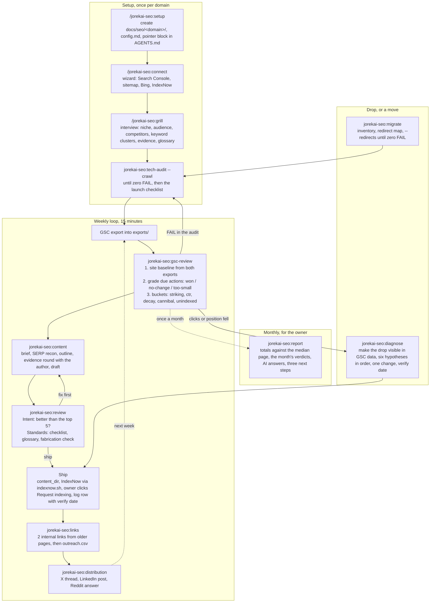
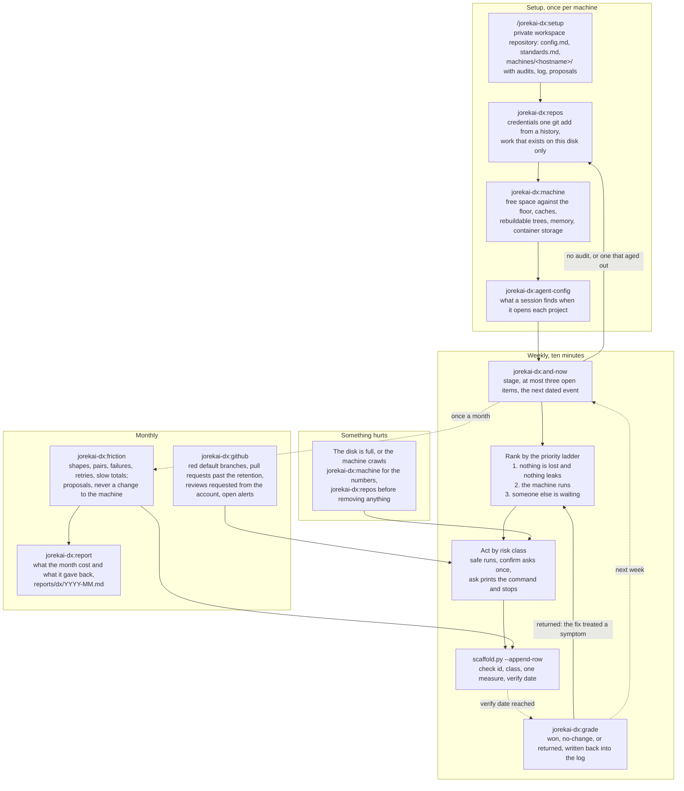
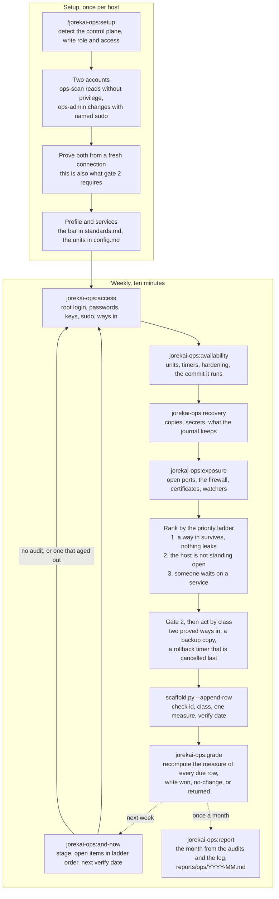

# skills

Hand-maintained skills for recurring work, one Claude Code plugin per theme. Install once, then the skills are slash commands in every repository:

```bash
claude plugin marketplace add jorekai/skills
claude plugin install jorekai-intro@jorekai    # the map: what is here and which part you need
claude plugin install jorekai-seo@jorekai      # search work on a site
claude plugin install jorekai-dx@jorekai       # the machine you work on
claude plugin install jorekai-ops@jorekai      # a host that serves
```

Install one, two, or all four; they share nothing at run time. Start with `/jorekai-intro:intro`, which draws the collection and names the one command to run next. Then `/jorekai-seo:setup` in the repository of a site, `/jorekai-dx:setup` for this machine, or `/jorekai-ops:setup` for a host that serves. Codex users link the same folders with `scripts/link.sh` (see "Use in a project").

Skills live under `skills/<theme>/<skill>/`. Each skill is a directory with `SKILL.md`, and optionally `references/` (knowledge loaded only when needed), `scripts/` (deterministic helpers, Python stdlib or bash only), `templates/` (files a skill writes into a project), and `agents/openai.yaml` (Codex metadata). Writing rules for every file: `STYLE.md`. Reasons behind the rules: `decisions/`. Versions: one changelog per plugin, `CHANGELOG.md` for `jorekai-seo`, and `skills/<theme>/CHANGELOG.md` for `jorekai-dx`, `jorekai-ops`, and `jorekai-intro`. Gate before every commit: `scripts/check.sh`. Contributions: `CONTRIBUTING.md`. License: MIT.

## Structure

- One user-invoked router per theme (for example `/jorekai-seo:seo`) names the sub-skills, the flows, and the priorities. No context cost until it is called.
- User-invoked skills (`disable-model-invocation: true` plus `policy.allow_implicit_invocation: false` in `agents/openai.yaml`) orchestrate; model-invoked skills with a sharp `description` (one trigger per branch) hold the reusable discipline. Steps end on a completion criterion; reference material sits behind pointers.
- No tool marketing in steps: tools appear only in `references/tools.md` and are interchangeable.
- State lives with its subject, never in the skill. The SEO skills read and write `docs/seo/<domain>/` in the site's repository (config, strategy, glossary, weekly log, briefs, drafts, exports, reports). The DX and ops skills read and write one private workspace repository, because their subject is a machine and not one project. They share it: one folder per machine, one log folder per theme. Either way the collection itself holds templates and scripts only.
- Every change leaves a row in a weekly log with a measure and a verify date, and the commit that carries it out ends with a trailer naming the row. Every theme learns from the log, not from memory.

## Themes

| Theme | Plugin | Router | What it covers |
|---|---|---|---|
| `skills/seo/` | `jorekai-seo` | `/jorekai-seo:seo` | One site in search: indexing, what almost ranks, content, links, moves, monthly report |
| `skills/dx/` | `jorekai-dx` | `/jorekai-dx:dx` | One machine to work on: the workspace, the weekly sweep, and what to do next |
| `skills/ops/` | `jorekai-ops` | `/jorekai-ops:ops` | One host that serves: who can reach it, what runs on it, what may change, and whether the change held |
| `skills/intro/` | `jorekai-intro` | `/jorekai-intro:intro` | The collection itself: every theme with its loop, every skill with who starts it and what it hands back |

## The map

`/jorekai-intro:intro` answers the question that comes before every other one here: what do you have in front of you, a site, the machine you work on, or a host that serves. It draws the themes, their loops, and every skill, then hands over one install line and one start command. It measures nothing, keeps no workspace, and writes no log row (`decisions/0024`).

The map is generated from the collection itself and never typed. `skills/intro/intro/scripts/catalog.py` reads the frontmatter of every `SKILL.md`, each router's tables, the plugin manifests, and the marketplace file, and writes `references/catalog.json`, the snapshot that ships inside the plugin. `catalog.py --check` compares that snapshot to the checkout and runs in `scripts/check.sh`, so a skill added, renamed, or removed anywhere fails the gate until the map knows it.

| Skill | Invoked by | Deterministic part |
|---|---|---|
| `jorekai-intro:intro` | user | `scripts/catalog.py`: the map as a report, `--json` for the object a page is filled from, `--theme` for one theme, `--check` for the gate; `templates/page.html`, the page it fills when the session can publish one |

## The SEO loop, start to end

Three phases. Setup once per domain, the weekly loop for good, diagnosis only when something drops. Everything that changes the site leaves a row in the log; the loop learns from the log, not from memory. Lost the thread: `jorekai-seo:and-now` reads the workspace and says which phase the domain is in and what comes next.



### What each SEO skill delivers

What a skill hands back has a shape too: one line of context, one table ordered by what it costs or earns, one line with the next action. The columns per skill stand in `jorekai-seo:seo` under `## Writing the answer` (`decisions/0023`).

| Step | Skill | Output | Why here |
|---|---|---|---|
| Set up | `jorekai-seo:setup` | `docs/seo/<domain>/` with `config.md`, log, briefs, drafts, exports, audits; pointer block in `AGENTS.md` and `CLAUDE.md` | Every later run starts warm: brand regex, CTR calibration, template paths are fixed. Several domains are several folders. |
| Connect | `jorekai-seo:connect` | `connect.sh`, a wizard that walks the human through the clicks and fills `connections.md` | Only a human can create the property, submit the sitemap, import into Bing, and place the IndexNow key. The wizard checks what it can check itself (sitemap 200, key file, IndexNow response). |
| Understand | `jorekai-seo:grill` | `strategy.md` (offer, audience, competitors, keyword clusters with priority, evidence inventory, constraints) and `glossary.md` | Facts are the agent's job (SERPs, export); decisions are the user's. Without an evidence inventory, drafts stay empty placeholders. |
| Check | `jorekai-seo:tech-audit` | Report with a fix per check id, applied in the template or written as CMS admin steps with the new value, full JSON in `audits/`, `tech` row in the log | Nothing counts before the pages are indexable. |
| Pick | `jorekai-seo:gsc-review` | The site baseline, then the verdict on due actions from earlier weeks, then one table: URL, query, current snippet, action, expected gain; every accepted row goes to the log, hosted sites get a prompt for the server session | Position 8–20 is closer to page 1 than any new article. A verdict against the median page instead of against the page's own past keeps seasonality out of the log. Verdicts first, so the same action is never recommended twice. A meta that promises a price the page does not name loses the click twice. |
| Write | `jorekai-seo:content` | `briefs/<slug>.md`, `drafts/<slug>.md` with evidence slots, one round of questions to the author, on-page checklist | One page, one intent. What the author has not confirmed stays a slot and never becomes a sentence. |
| Approve | `jorekai-seo:review` | Two separate reports, each with a verdict: `ship` or `fix first` | A page can be right for the query and still unbacked, or the reverse. Separate axes cannot hide each other. |
| Link | `jorekai-seo:links` | Internal links first, then `outreach.csv` with a reason per target, emails, status | Internal links cost nothing and work immediately. Paid links carry `rel="sponsored"`. |
| Distribute | `jorekai-seo:distribution` | Three texts, keyword in line one, the link where it completes the answer | Reach and referral traffic, not ranking credit: Reddit and LinkedIn set `nofollow`. |
| Move | `jorekai-seo:migrate` | Inventory of the old URLs, `redirect-map.csv`, the owner's console steps, then `audit.py --redirects` until zero FAIL, `tech` rows in the log | Every URL that earns clicks either survives as a permanent redirect or its ranking is gone. A move judged by "the site is up" is not judged. |
| Repair | `jorekai-seo:diagnose` | The red line from the export, ranked hypotheses with predictions, one change, `diagnose` row in the log | Data first, theory second. Two changes in one verify window make the outcome unreadable. |
| Report | `jorekai-seo:report` | `reports/YYYY-MM.md`: totals and the median page from the month's exports, every action with its verdict, AI answer visibility, three next steps with log ids | The owner asks what the money bought. Everything needed sits in the workspace already, so the report costs no new data and no new claim. |
| Orient | `jorekai-seo:and-now` | Stage (setup, audit, loop), open log rows, verify dates due, export age, briefs without drafts, drafts not shipped, last month without a report; the next skill to call | The state of the loop lives in files, not in anyone's memory. One command answers "and now?" after a break. |

### The SEO log

`docs/seo/<domain>/log/2026-W36.md`, one file per week. Every action has an id, a bucket, a status (`todo`, `applied`, `verify`, `won`, `no-change`, `too-small`, `dropped`), the metric it started from (`Then`), and a verify date: 14 days for title and meta, 28 days for content, links, and diagnosis. `scaffold.py <domain> --due` lists what is due; `jorekai-seo:gsc-review` records the verdict. After a few weeks the log says which actions work on this site and which do not.

## SEO skills

Theme `skills/seo/`. You call user-invoked skills yourself (`/jorekai-seo:<name>` in Claude Code, `$seo-<name>` in Codex); the agent reaches for model-invoked skills when the task fits.

| Skill | Invoked by | Deterministic part |
|---|---|---|
| `jorekai-seo:seo` | user | Router: workspace, three flows, priority ladder, launch checklist, domain naming, tool stack, `references/sources.md` |
| `jorekai-seo:setup` | user | `scripts/scaffold.py`: create folders, `--log` (log path and next id), `--due` (actions due, with their `Then` value), `--check` (missing files, directories, and sections a template has gained) |
| `jorekai-seo:report` | user | no script of its own: the totals and baseline of `gsc_opportunities.py`, the month's log rows, `templates/report.md`, `references/ai-visibility.md` |
| `jorekai-seo:and-now` | user | `scripts/status.py [domain]`: stage and next steps from the workspace files, no network |
| `jorekai-seo:connect` | user | `templates/wizard.sh`: wizard library; `references/stages.md`: verified click paths; `scripts/indexnow.sh <domain> URL…`: submit changed URLs to IndexNow |
| `jorekai-seo:grill` | user | `references/question-bank.md`: the question tree |
| `jorekai-seo:tech-audit` | model | `scripts/audit.py URL --crawl N` |
| `jorekai-seo:gsc-review` | model | `scripts/gsc_opportunities.py EXPORT --previous EXPORT`: site baseline, six buckets, and an `expected_ctr_1` suggestion (tests: `scripts/test_gsc.py`); `scripts/snippets.py URL --query Q`: current title, meta, H1, og:title, dateModified with flags |
| `jorekai-seo:content` | model | `references/page-types.md`, `references/on-page-checklist.md` |
| `jorekai-seo:review` | model | two subagent briefs with a fixed word limit |
| `jorekai-seo:diagnose` | model | `references/hypotheses.md`: six hypotheses with prediction, check, fix |
| `jorekai-seo:migrate` | model | `tech-audit/scripts/audit.py URL --redirects map.csv`: one fetch per row, permanent hop, live target, the target the map names; `templates/redirect-map.csv` |
| `jorekai-seo:links` | model | `references/link-quality.md`, `references/outreach-templates.md` |
| `jorekai-seo:distribution` | model | `references/formats.md` |

## The DX loop, start to end

Two phases carry it: setup once per machine, then a short weekly pass for good. Monthly, two further passes ask what the command history and the forge say. The loop is the same shape as the SEO one: measure, fix the thing that costs the most time for the least work, write a row with a measure and a verify date, and grade it when the date comes. Nothing is removed that a person would have to rebuild by hand.

Where the SEO workspace lives in the site's repository, the DX workspace is a private repository of its own. Its subject is the machine, so a finding like "four repositories hold unpushed commits" belongs to none of the four.



### What each DX skill delivers

What a skill hands back has a shape too: one line of context, one table in ladder order of at most five rows, one line with the next action. The columns per skill stand in the router under `## Writing the answer` (`decisions/0023`).

| Step | Skill | Output | Why here |
|---|---|---|---|
| Set up | `jorekai-dx:setup` | A private workspace repository: `config.md`, `standards.md`, and `machines/<hostname>/` with `audits/`, `log/`, `proposals/`; a pointer line in the agent file the user already keeps | Standards are the thing every later check measures against. A value left blank turns its check off, which beats a number nobody believes. |
| Orient | `jorekai-dx:and-now` | Stage (setup, measure, loop), rows past their verify date, open findings from the newest audit, open log rows, rows naming a check id no tool measures, proposals without a decision; the next thing to run | The state of the machine lives in files, not in anyone's memory. One command answers "and now?" after a break, without touching the machine or the network. |
| Secure | `jorekai-dx:repos` | One pass over every local repository: untracked credential files nothing ignores, uncommitted changes, commits on no remote, no upstream, detached HEAD, old stashes, merged branches, lock drift, missing README, ignore file, or checks; full JSON in `audits/` | Work that exists on one disk and a credential one `git add` from a history are the two findings a later commit cannot undo. They outrank a full disk, and nothing destructive runs against a repository that reports one. |
| Reclaim | `jorekai-dx:machine` | Free space against the floor, cache directories by size, rebuildable dependency and build trees, available memory, and what the container runtime reports as reclaimable; full JSON in `audits/` | "The disk is full" is not a task. A list of trees a manifest rebuilds, ordered by bytes returned per risk taken, is one. |
| Unblock | `jorekai-dx:github` | Failed runs on default branches, pull requests past the retention, reviews requested from the account, open alerts, unprotected branches; one table per class from subagents, saved as an audit | The only findings whose cost falls on someone else. A review someone waits on outranks a red pipeline nobody is releasing. |
| Align | `jorekai-dx:agent-config` | Per project: the pointer file, its accuracy, permissions against the standard, hooks whose command exists, servers that answer | A broken hook fails on every tool call in that project, and a pointer that names a moved path costs more than no pointer at all. |
| Grade | `jorekai-dx:grade` | The verdict for every log row past its verify date: the starting measure, the recomputed one, and `won`, `no-change`, or `returned` written back into the log | A loop that never settles its rows is a list of good intentions. The verdict is arithmetic on two numbers from the same script, so it costs nothing to be honest. |
| Automate | `jorekai-dx:friction` | Command shapes that repeat, pairs run in order, shapes that fail, retry loops, slowest totals; `proposals/<slug>.md`, never a change to the machine | Two commands that always follow each other are one command that does not exist yet. Every line is redacted before it is counted. |

| Report | `jorekai-dx:report` | `reports/dx/YYYY-MM.md`: what every check cost when the month opened and what it costs now, every action of the month with its verdict, what is still open in ladder order, and the three rows the next month starts with | The loop answers "what next" every week and never "what did the month give back". Every number is already in the workspace, so the report costs no new measurement. |
### The DX log

`machines/<hostname>/log/2026-W36.md`, one file per week. Every action has an id, the check id that found it, the risk class it ran under, the measure it started from (`Then`), a status (`todo`, `applied`, `verify`, `won`, `no-change`, `returned`, `dropped`), and a verify date. `scaffold.py --append-row` writes the row from named fields, and `scaffold.py --due` lists what is due.

An action is written down only with a measure the same script can recompute, as one number and one unit: `42 GB`, `12 count`, `600 seconds`. Every measure counts a cost, so lower is better and zero means the finding is gone; free space is logged as the bytes missing from the floor for that reason. Anything without such a measure goes to `proposals/` instead, so the log never fills with "cleaned up, feels better".

`jorekai-dx:grade` settles a due row: it reads the newest audit of the tool that found the check, recomputes the measure for that row's target, and writes `won`, `no-change`, or `returned`. `dropped` stays a human word for an action nobody carried out. `returned` is the interesting verdict: the finding came back inside the verify window, so the fix treated a symptom.

A commit that carries an action out in a project repository ends with the trailer `DX-Log: <row id>`, so the diff and the reason find each other later.

## DX skills

Theme `skills/dx/`. You call user-invoked skills yourself (`/jorekai-dx:<name>` in Claude Code, `$dx-<name>` in Codex); the agent reaches for the measuring skills when the task fits.

| Skill | Invoked by | Deterministic part |
|---|---|---|
| `jorekai-dx:dx` | user | Router: workspace, flows, priority ladder, `references/fixes.md` (check id, fix, class, measure), `references/risk-classes.md`, `references/tools.md`, `references/sources.md` |
| `jorekai-dx:setup` | user | `scripts/scaffold.py`: create the workspace, `--log` (log path, next id, commit trailer), `--append-row` (one action row from named fields), `--due` (rows past their verify date, with their `Then` value), `--check` (missing files, directories, and sections a template has gained) |
| `jorekai-dx:and-now` | user | `scripts/status.py [machine]`: stage and next steps from the workspace files, no machine access and no network |
| `jorekai-dx:repos` | model | `scripts/repos.py PATH ...`: every local repository in one pass, one item per check id with the full list under `data`, no fetch and no push |
| `jorekai-dx:machine` | model | `scripts/machine.py [PATH ...]`: volume, memory, caches, rebuildable trees, container storage; measures only, removes nothing |
| `jorekai-dx:github` | model | no script of its own: one subagent per class, each returning one table with a fixed word limit |
| `jorekai-dx:agent-config` | model | no script of its own: subagents read at most ten projects each and return one table |
| `jorekai-dx:grade` | model | `scripts/grade.py [machine] [--write]`: the verdict for every row past its verify date, measured against the newest audit of the tool that found the check |
| `jorekai-dx:report` | user | `scripts/report.py [machine] --month YYYY-MM [--write]`: the audits that open and close the month, the log rows inside it with their verdicts, what is still open in ladder order, `templates/report.md` |
| `jorekai-dx:friction` | user | `scripts/friction.py --db F --history F --sessions D`: shapes, sequences, failures, retries, slow totals; redacts every line before counting and prints no command line at all |

### The check id

Every finding carries a dotted id: `git.dirty`, `disk.cache`, `ci.failing`, `agent.hook-broken`, `friction.retry-prompt`. The id is the join key between a script's output, the log row, and `skills/dx/dx/references/fixes.md`, which gives each one its meaning, its fix, its risk class, and the measure that grades it later, with the unit that measure is written in. A finding whose id has no measure in that table is a proposal, not an action.

### Risk classes

Every destructive action carries one of three classes, decided once in the reference and looked up at run time, never judged in the moment. `safe` runs immediately and reports what it removed. `confirm` prints a dry run with exact paths and totals, asks once, then runs. `ask` never runs and prints the command with its reason. Above all three sits one gate: nothing destructive runs against a repository holding uncommitted or unpushed work. Details: `skills/dx/dx/references/risk-classes.md`.

## The ops loop, start to end

Two phases, the same shape as the other two: setup once per host, then a short weekly pass. What is different is the order inside setup, and it is not a preference. The connection that would repair a mistake in ssh, the firewall or sudo is the connection the mistake closes, so the second way in exists before anything hardens the first.

The workspace is the one the DX skills keep, because the subject is again a machine. One folder per host, one log folder per theme, so both themes measure the same box without writing into one file. Reasons: `decisions/0015`.



### What each ops skill delivers

What a skill hands back has a shape too: one line of context, one table in ladder order of at most five rows, one line with the next action. The columns per skill stand in the router under `## Writing the answer` (`decisions/0023`).

| Step | Skill | Output | Why here |
|---|---|---|---|
| Set up | `jorekai-ops:setup` | The host in the shared workspace: `role`, `control_plane`, `access`, `access_paths`, `services`, and the chosen profile in `standards.md`; a reading account without privilege and a changing account with named sudo | The control plane decides which surface every later fix writes to, and a blank one means guessed fixes. The two accounts are what lets a measuring pass run often without exposing anything that can change the host. |
| Orient | `jorekai-ops:and-now` | Stage, rows past their verify date, rows waiting for a tool that has not shipped, rows naming an id this theme does not own, failing ids in ladder order, the next verify date | The state of a host lives in files. One command answers "and now?" after a break, without touching the host and without the network. |
| Reach | `jorekai-ops:access` | Root login, password authentication, weak algorithms, missing limits in front of sshd, keys without an owner or past rotation or under the bar, shared keys, passwordless sudo, unnamed accounts, and how many independent ways in exist; full JSON in `audits/` | A host with one way in cannot be hardened at all, so `access.single-path` is a precondition as much as a priority. |
| Settle | `jorekai-ops:grade` | One verdict per log row past its verify date, recomputed from the newest audit of the tool that found it: `won`, `no-change`, or `returned`, written into the log beside the action | A row without a verdict is a claim nobody checked. `returned` under `ssh.*` or `key.*` means a way in came back, which is why it goes to the front of the ladder. |
| Close | `jorekai-ops:exposure` | Ports open to anywhere, ports nobody named, a panel on the open network, a firewall that is not filtering, rules for ports nothing serves, certificates past their date or close to it, and units that should watch failed attempts; full JSON in `audits/` | The socket decides what is reachable, never the rule in front of it. Every fix here changes a way in, so gate 2 runs before any of them. |
| Survive | `jorekai-ops:recovery` | Targets with no copy, copies past their window, copies that all sit on this host, targets nobody restored, secrets missing or readable beyond their owner or sitting in a work tree, credentials passed to a unit as environment variables, and the two bounds on the journal; full JSON in `audits/` | A copy is the only finding here that a later day cannot repair, and a secret in a history is the other. Both stand on the first rung beside the ways in. |
| Run | `jorekai-ops:availability` | Units down or failed, restarts over the bar, timers not enabled or past their elapse, required unit options, the distance to the commit the standards name, repositories with no identity file, services with no deploy path; full JSON in `audits/` | These are the findings whose cost falls on other people. A failed unit and a stopped one are counted apart, because they need different fixes. |

| Report | `jorekai-ops:report` | `reports/ops/YYYY-MM.md`: the same shape as the DX report, with the class each action ran under beside its verdict | The owner of a host asks what the month changed. The audits and the log already hold it, so nothing is measured again for the answer. |
### The ops log

`machines/<hostname>/log/ops/2026-W36.md`, one file per week, one folder per theme. The row format is the DX one: an id, the check id that found it, the risk class it ran under, the measure it started from (`Then`), a status, and a verify date. The trailer on a commit that carries an action out is `Ops-Log: <row id>`.

Two rules differ. `safe` is off until a host turns it on: while `allow_safe` is `no`, a row classed `safe` runs as `confirm` and the row records the class that actually ran. And a row whose check id belongs to this theme but whose tool has not shipped yet is parked, not broken: `jorekai-ops:and-now` names the skill that will measure it and leaves its verify date empty, because a date nobody can measure at is a verdict nobody can give. The planned skills stand in a table in the router, and `scripts/check.sh` reads it, so no file may name a skill that neither exists nor is planned.

### The two gates

Above the three risk classes sit two gates. The first is inherited: nothing destructive runs against a repository holding uncommitted or unpushed work, and a deploy path is a repository. The second is this theme's own, in front of every change under `ssh.*`, `key.*`, `fw.*`, `sudo.*` and `user.*`: two independent ways in must answer from freshly opened connections, the change writes a backup copy, it arms a timer on the host that restores that copy after ten minutes, and the timer is cancelled only after a new connection succeeds. A change that cannot arm the timer does not run. Details: `skills/ops/ops/references/risk-classes.md`, reasons: `decisions/0016` and `decisions/0019`.

## Ops skills

Theme `skills/ops/`. You call user-invoked skills yourself (`/jorekai-ops:<name>` in Claude Code, `$ops-<name>` in Codex); the agent reaches for the measuring skills when the task fits.

| Skill | Invoked by | Deterministic part |
|---|---|---|
| `jorekai-ops:ops` | user | Router: workspace, flows, priority ladder, `references/fixes.md` (check id, class, measure, and a fix per control plane), `references/risk-classes.md`, `references/tools.md`, `references/sources.md` |
| `jorekai-ops:setup` | user | `scripts/scaffold.py`: create the host folder, `--check` (missing files and sections a shared file lacks), `--flags` (the arguments each measuring script takes), `--log`, `--append-row`, `--due`; `scripts/remote.sh`: send a script over ssh, run it as the reading account, remove it, return the JSON (`--fetch`, `--probe`, `--dry-run`) |
| `jorekai-ops:and-now` | user | `scripts/status.py [host]`: stage and next steps from the workspace files, no host access and no network |
| `jorekai-ops:access` | model | `scripts/access.py`: eleven checks over sshd, authorized keys, sudo and accounts; `--root` reads a captured tree instead of the running host, which is what makes the parsers testable offline |
| `jorekai-ops:availability` | model | `scripts/availability.py`: nine checks over units, timers, required options and deploy paths; `--show-dir` reads captured `systemctl show` output instead of systemd |
| `jorekai-ops:exposure` | model | `scripts/exposure.py`: eight checks over listening sockets, the firewall, certificates and the units that watch failed attempts; `--ss-file`, `--fw-file`, `--enddate-dir` and `--show-dir` read captured output instead of the running host |
| `jorekai-ops:recovery` | model | `scripts/recovery.py`: ten checks over backup targets, secret files, unit credentials and the journal; `--root` reads a captured tree, `--filesystem-bytes` fixes the size the share is measured against, and no check ever reads the contents of a secret |
| `jorekai-ops:report` | user | `scripts/report.py [host] --month YYYY-MM [--write]`: the month from the audits and the log alone, `templates/report.md` |
| `jorekai-ops:grade` | model | `scripts/grade.py [host]`: recompute the measure of every due log row from the newest audit of its tool, `--write` puts the verdict in the log, `--namespaces` prints which tool owns which check id namespace |

## Use in a project

The collection is a Claude Code plugin (`.claude-plugin/plugin.json`, marketplace `jorekai` in `.claude-plugin/marketplace.json`). Installed once at user scope, every skill is available in every repo as `/jorekai-<theme>:<name>`, with autocomplete after `/jorekai-`:

```bash
claude plugin marketplace add jorekai/skills                  # once; a local checkout works too: marketplace add /path/to/skills
claude plugin install jorekai-intro@jorekai
claude plugin install jorekai-seo@jorekai
claude plugin install jorekai-dx@jorekai
claude plugin install jorekai-ops@jorekai
```

Then `/jorekai-intro:intro` for the map, `/jorekai-seo:setup` and the router `/jorekai-seo:seo`, `/jorekai-dx:setup` and `/jorekai-dx:dx`, or `/jorekai-ops:setup` and `/jorekai-ops:ops`. The install is a copy under `~/.claude/plugins/cache/jorekai/`, not a link: after editing a theme, bump `version` in that plugin's manifest, run `claude plugin marketplace update jorekai` and `claude plugin update <plugin>@jorekai`, then start a new session.

Codex reads `<repo>/.agents/skills/<name>/`; the link script fills that folder:

```bash
scripts/link.sh <repo>            # every skill of every theme
scripts/link.sh <repo> seo        # one theme (skills/seo/*)
scripts/link.sh <repo> setup      # named skills, globs allowed
```

A link is named `<theme>-<skill>`, the same pair as the plugin invocation, so `$seo-setup` and `$dx-setup` in Codex do not collide. A theme whose only skill carries the theme's own name links as `<theme>`, so the map is `$intro`. When a skill is stable: move it to `~/Developer/claude-skill-library/skills/` and distribute it with `link.sh` from `project-index`.

The SEO workspace belongs in the site's repository. A site that lives in no repository (a hosted CMS) gets a small private repository of its own that holds only `docs/seo/`, the pointer block, and the Codex links. The DX and ops workspace is always a private repository of its own, because its subject is a machine and not one project. Both themes share it, one folder per machine and one log folder per theme. This collection is public and carries no workspace, key, ID, or customer data; `scripts/check.sh` enforces that before every commit.

## Maintenance

- `STYLE.md` is the rulebook for prose, code, commits, and private data. Every agent reads it through `AGENTS.md` (Codex, Cursor, Gemini) or `CLAUDE.md` (Claude Code).
- `bash scripts/check.sh` before every commit: style, private data, then every offline test and syntax check. Runs gitleaks over the history when installed (`brew install gitleaks`); CI always does. Prints `ok` or one line per hit. Customer names to reject live in `.check_public.local` (gitignored, one regex per line); CI writes it from the secret `CHECK_PUBLIC_LOCAL`.
- Every line in a SKILL.md must change behaviour; what the model does anyway goes.
- The router must not lie: whoever adds, renames, or changes a sub-skill checks `skills/<theme>/<theme>/SKILL.md` and that theme's table above in the same commit, and bumps that plugin's version. `check.sh` enforces both directions: a skill missing from the router or from this file, and a `jorekai-<theme>:<name>` that names no directory.
- The map must not lie either, and nobody edits it by hand: after a change to any skill, run `python3 skills/intro/intro/scripts/catalog.py --scan . --json > skills/intro/intro/references/catalog.json` in the same commit. `check.sh` runs `catalog.py --check` and fails until the snapshot matches the checkout.
- A step that hands findings, picks, or drafts to a person names the columns of its table, the order, and the row cap; the frame stands once per theme in the router's `## Writing the answer`. `check.sh` fails when a router lacks that section, when a sub-skill is missing from it, and when the columns the router gives a skill stand in no line of that skill's `SKILL.md`.
- Years, tool names, platform behaviour, and Google features stay out of the steps; a sourced fact stands in a skill's rules or interpretation section, and material a reader looks up goes to `references/`. Every such claim has a row in that theme's `references/sources.md` with URL and check date. Unverified means: labelled as a heuristic, or removed. `python3 scripts/sources_age.py` lists rows older than 180 days; `check.sh` prints them as warnings. Settle those rows once a quarter: re-check against the primary source and move the date, rewrite the claim as a heuristic, or delete it together with what rests on it.
- Every release touches one plugin: bump `version` in that plugin's manifest, add the entry at the top of the changelog beside it, push, then `claude plugin marketplace update jorekai` and `claude plugin update <plugin>@jorekai`, then start a new session. A running session keeps the skill set it started with, so a skill added by the update answers `Unknown skill` until it restarts.
