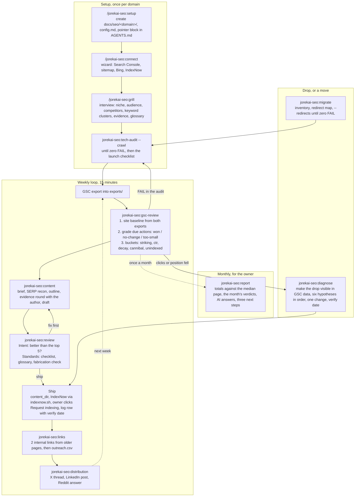

# skills

Hand-maintained skills for recurring work, one Claude Code plugin per theme. Install once, then the skills are slash commands in every repository:

```bash
claude plugin marketplace add jorekai/skills
claude plugin install jorekai-seo@jorekai      # search work on a site
claude plugin install jorekai-dx@jorekai       # the machine you work on
```

Install one or both; they share nothing at run time. Then `/jorekai-seo:setup` in the repository of a site, or `/jorekai-dx:setup` for this machine. Codex users link the same folders with `scripts/link.sh` (see "Use in a project").

Skills live under `skills/<theme>/<skill>/`. Each skill is a directory with `SKILL.md`, and optionally `references/` (knowledge loaded only when needed), `scripts/` (deterministic helpers, Python stdlib or bash only), `templates/` (files a skill writes into a project), and `agents/openai.yaml` (Codex metadata). Writing rules for every file: `STYLE.md`. Reasons behind the rules: `decisions/`. Versions: one changelog per plugin, `CHANGELOG.md` for `jorekai-seo` and `skills/dx/CHANGELOG.md` for `jorekai-dx`. Gate before every commit: `scripts/check.sh`. Contributions: `CONTRIBUTING.md`. License: MIT.

## Structure

- One user-invoked router per theme (for example `/jorekai-seo:seo`) names the sub-skills, the flows, and the priorities. No context cost until it is called.
- User-invoked skills (`disable-model-invocation: true` plus `policy.allow_implicit_invocation: false` in `agents/openai.yaml`) orchestrate; model-invoked skills with a sharp `description` (one trigger per branch) hold the reusable discipline. Steps end on a completion criterion; reference material sits behind pointers.
- No tool marketing in steps: tools appear only in `references/tools.md` and are interchangeable.
- State lives with its subject, never in the skill. The SEO skills read and write `docs/seo/<domain>/` in the site's repository (config, strategy, glossary, weekly log, briefs, drafts, exports, reports). The DX skills read and write one private workspace repository, because their subject is the machine and not one project. Either way the collection itself holds templates and scripts only.
- Every change leaves a row in a weekly log with a measure and a verify date, and the commit that carries it out ends with a trailer naming the row. Both themes learn from the log, not from memory.

## Themes

| Theme | Plugin | Router | What it covers |
|---|---|---|---|
| `skills/seo/` | `jorekai-seo` | `/jorekai-seo:seo` | One site in search: indexing, what almost ranks, content, links, moves, monthly report |
| `skills/dx/` | `jorekai-dx` | `/jorekai-dx:dx` | One machine to work on: the workspace, the weekly sweep, and what to do next |

## The SEO loop, start to end

Three phases. Setup once per domain, the weekly loop for good, diagnosis only when something drops. Everything that changes the site leaves a row in the log; the loop learns from the log, not from memory. Lost the thread: `jorekai-seo:and-now` reads the workspace and says which phase the domain is in and what comes next.



### What each SEO skill delivers

| Step | Skill | Output | Why here |
|---|---|---|---|
| Set up | `jorekai-seo:setup` | `docs/seo/<domain>/` with `config.md`, log, briefs, drafts, exports, audits; pointer block in `AGENTS.md` and `CLAUDE.md` | Every later run starts warm: brand regex, CTR calibration, template paths are fixed. Several domains are several folders. |
| Connect | `jorekai-seo:connect` | `connect.sh`, a wizard that walks the human through the clicks and fills `connections.md` | Only a human can create the property, submit the sitemap, import into Bing, and place the IndexNow key. The wizard checks what it can check itself (sitemap 200, key file, IndexNow response). |
| Understand | `jorekai-seo:grill` | `strategy.md` (offer, audience, competitors, keyword clusters with priority, evidence inventory, constraints) and `glossary.md` | Facts are the agent's job (SERPs, export); decisions are the user's. Without an evidence inventory, drafts stay empty placeholders. |
| Check | `jorekai-seo:tech-audit` | Report with a fix per check id, applied in the template or written as CMS admin steps with the new value, full JSON in `audits/`, `tech` row in the log | Nothing counts before the pages are indexable. |
| Pick | `jorekai-seo:gsc-review` | The site baseline, then the verdict on due actions from earlier weeks, then one table: URL, query, current snippet, action, expected gain; every accepted row goes to the log, hosted sites get a prompt for the server session | Position 8–20 is closer to page 1 than any new article. A verdict against the median page instead of against the page's own past keeps seasonality out of the log. Verdicts first, so the same action is never recommended twice. A meta that promises a price the page does not name loses the click twice. |
| Write | `jorekai-seo:content` | `briefs/<slug>.md`, `drafts/<slug>.md` with evidence slots, one round of questions to the author, on-page checklist | One page, one intent. What the author has not confirmed stays a slot and never becomes a sentence. |
| Approve | `jorekai-seo:review` | Two separate reports, each with a verdict: `ship` or `fix first` | A page can be right for the query and still unbacked, or the reverse. Separate axes cannot hide each other. |
| Link | `jorekai-seo:links` | Internal links first, then `outreach.csv` with a reason per target, emails, status | Internal links cost nothing and work immediately. Paid links carry `rel="sponsored"`. |
| Distribute | `jorekai-seo:distribution` | Three texts, keyword in line one, the link where it completes the answer | Reach and referral traffic, not ranking credit: Reddit and LinkedIn set `nofollow`. |
| Move | `jorekai-seo:migrate` | Inventory of the old URLs, `redirect-map.csv`, the owner's console steps, then `audit.py --redirects` until zero FAIL, `tech` rows in the log | Every URL that earns clicks either survives as a permanent redirect or its ranking is gone. A move judged by "the site is up" is not judged. |
| Repair | `jorekai-seo:diagnose` | The red line from the export, ranked hypotheses with predictions, one change, `diagnose` row in the log | Data first, theory second. Two changes in one verify window make the outcome unreadable. |
| Report | `jorekai-seo:report` | `reports/YYYY-MM.md`: totals and the median page from the month's exports, every action with its verdict, AI answer visibility, three next steps with log ids | The owner asks what the money bought. Everything needed sits in the workspace already, so the report costs no new data and no new claim. |
| Orient | `jorekai-seo:and-now` | Stage (setup, audit, loop), open log rows, verify dates due, export age, briefs without drafts, drafts not shipped, last month without a report; the next skill to call | The state of the loop lives in files, not in anyone's memory. One command answers "and now?" after a break. |

### The SEO log

`docs/seo/<domain>/log/2026-W36.md`, one file per week. Every action has an id, a bucket, a status (`todo`, `applied`, `verify`, `won`, `no-change`, `too-small`, `dropped`), the metric it started from (`Then`), and a verify date: 14 days for title and meta, 28 days for content, links, and diagnosis. `scaffold.py <domain> --due` lists what is due; `jorekai-seo:gsc-review` records the verdict. After a few weeks the log says which actions work on this site and which do not.

## SEO skills

Theme `skills/seo/`. You call user-invoked skills yourself (`/jorekai-seo:<name>` in Claude Code, `$seo-<name>` in Codex); the agent reaches for model-invoked skills when the task fits.

| Skill | Invoked by | Deterministic part |
|---|---|---|
| `jorekai-seo:seo` | user | Router: workspace, three flows, priority ladder, launch checklist, domain naming, tool stack, `references/sources.md` |
| `jorekai-seo:setup` | user | `scripts/scaffold.py`: create folders, `--log` (log path and next id), `--due` (actions due, with their `Then` value), `--check` (missing files, directories, and sections a template has gained) |
| `jorekai-seo:report` | user | no script of its own: the totals and baseline of `gsc_opportunities.py`, the month's log rows, `templates/report.md`, `references/ai-visibility.md` |
| `jorekai-seo:and-now` | user | `scripts/status.py [domain]`: stage and next steps from the workspace files, no network |
| `jorekai-seo:connect` | user | `templates/wizard.sh`: wizard library; `references/stages.md`: verified click paths; `scripts/indexnow.sh <domain> URL…`: submit changed URLs to IndexNow |
| `jorekai-seo:grill` | user | `references/question-bank.md`: the question tree |
| `jorekai-seo:tech-audit` | model | `scripts/audit.py URL --crawl N` |
| `jorekai-seo:gsc-review` | model | `scripts/gsc_opportunities.py EXPORT --previous EXPORT`: site baseline, six buckets, and an `expected_ctr_1` suggestion (tests: `scripts/test_gsc.py`); `scripts/snippets.py URL --query Q`: current title, meta, H1, og:title, dateModified with flags |
| `jorekai-seo:content` | model | `references/page-types.md`, `references/on-page-checklist.md` |
| `jorekai-seo:review` | model | two subagent briefs with a fixed word limit |
| `jorekai-seo:diagnose` | model | `references/hypotheses.md`: six hypotheses with prediction, check, fix |
| `jorekai-seo:migrate` | model | `tech-audit/scripts/audit.py URL --redirects map.csv`: one fetch per row, permanent hop, live target, the target the map names; `templates/redirect-map.csv` |
| `jorekai-seo:links` | model | `references/link-quality.md`, `references/outreach-templates.md` |
| `jorekai-seo:distribution` | model | `references/formats.md` |

## The DX loop, start to end

Two phases. Setup once per machine, then a short weekly pass for good. The loop is the same shape as the SEO one: measure, fix the thing that costs the most time for the least work, write a row with a measure and a verify date, and grade it when the date comes. Nothing is removed that a person would have to rebuild by hand.

Where the SEO workspace lives in the site's repository, the DX workspace is a private repository of its own. Its subject is the machine, so a finding like "four repositories hold unpushed commits" belongs to none of the four.

### What each DX skill delivers

| Step | Skill | Output | Why here |
|---|---|---|---|
| Set up | `jorekai-dx:setup` | A private workspace repository: `config.md`, `standards.md`, and `machines/<hostname>/` with `audits/`, `log/`, `proposals/`; a pointer line in the agent file the user already keeps | Standards are the thing every later check measures against. A value left blank turns its check off, which beats a number nobody believes. |
| Orient | `jorekai-dx:and-now` | Stage (setup, measure, loop), rows past their verify date, open findings from the newest audit, open log rows, proposals without a decision; the next thing to run | The state of the machine lives in files, not in anyone's memory. One command answers "and now?" after a break, without touching the machine or the network. |

### The DX log

`machines/<hostname>/log/2026-W36.md`, one file per week. Every action has an id, the check id that found it, the risk class it ran under, the measure it started from (`Then`), a status (`todo`, `applied`, `verify`, `won`, `no-change`, `returned`, `dropped`), and a verify date. `scaffold.py --due` lists what is due.

An action is written down only with a measure the same script can recompute: reclaimed bytes, a count of failing checks, a duration. Anything else goes to `proposals/` instead, so the log never fills with "cleaned up, feels better". `returned` is the interesting verdict: the finding came back inside the verify window, so the fix treated a symptom.

A commit that carries an action out in a project repository ends with the trailer `DX-Log: <row id>`, so the diff and the reason find each other later.

## DX skills

Theme `skills/dx/`. Everything here is user-invoked so far; the measuring skills that the agent reaches for on its own arrive with the next versions.

| Skill | Invoked by | Deterministic part |
|---|---|---|
| `jorekai-dx:dx` | user | Router: workspace, flows, priority ladder, `references/risk-classes.md`, `references/sources.md` |
| `jorekai-dx:setup` | user | `scripts/scaffold.py`: create the workspace, `--log` (log path, next id, commit trailer), `--due` (rows past their verify date, with their `Then` value), `--check` (missing files, directories, and sections a template has gained) |
| `jorekai-dx:and-now` | user | `scripts/status.py [machine]`: stage and next steps from the workspace files, no machine access and no network |

### Risk classes

Every destructive action carries one of three classes, decided once in the reference and looked up at run time, never judged in the moment. `safe` runs immediately and reports what it removed. `confirm` prints a dry run with exact paths and totals, asks once, then runs. `ask` never runs and prints the command with its reason. Above all three sits one gate: nothing destructive runs against a repository holding uncommitted or unpushed work. Details: `skills/dx/dx/references/risk-classes.md`.

## Use in a project

The collection is a Claude Code plugin (`.claude-plugin/plugin.json`, marketplace `jorekai` in `.claude-plugin/marketplace.json`). Installed once at user scope, every skill is available in every repo as `/jorekai-<theme>:<name>`, with autocomplete after `/jorekai-`:

```bash
claude plugin marketplace add jorekai/skills                  # once; a local checkout works too: marketplace add /path/to/skills
claude plugin install jorekai-seo@jorekai
claude plugin install jorekai-dx@jorekai
```

Then `/jorekai-seo:setup` and the router `/jorekai-seo:seo`, or `/jorekai-dx:setup` and `/jorekai-dx:dx`. The install is a copy under `~/.claude/plugins/cache/jorekai/`, not a link: after editing a theme, bump `version` in that plugin's manifest, run `claude plugin marketplace update jorekai` and `claude plugin update <plugin>@jorekai`, then start a new session.

Codex reads `<repo>/.agents/skills/<name>/`; the link script fills that folder:

```bash
scripts/link.sh <repo>            # every skill of every theme
scripts/link.sh <repo> seo        # one theme (skills/seo/*)
scripts/link.sh <repo> setup      # named skills, globs allowed
```

A link is named `<theme>-<skill>`, the same pair as the plugin invocation, so `$seo-setup` and `$dx-setup` in Codex do not collide. When a skill is stable: move it to `~/Developer/claude-skill-library/skills/` and distribute it with `link.sh` from `project-index`.

The SEO workspace belongs in the site's repository. A site that lives in no repository (a hosted CMS) gets a small private repository of its own that holds only `docs/seo/`, the pointer block, and the Codex links. The DX workspace is always a private repository of its own, because its subject is the machine. This collection is public and carries no workspace, key, ID, or customer data; `scripts/check.sh` enforces that before every commit.

## Maintenance

- `STYLE.md` is the rulebook for prose, code, commits, and private data. Every agent reads it through `AGENTS.md` (Codex, Cursor, Gemini) or `CLAUDE.md` (Claude Code).
- `bash scripts/check.sh` before every commit: style, private data, then every offline test and syntax check. Runs gitleaks over the history when installed (`brew install gitleaks`); CI always does. Prints `ok` or one line per hit. Customer names to reject live in `.check_public.local` (gitignored, one regex per line); CI writes it from the secret `CHECK_PUBLIC_LOCAL`.
- Every line in a SKILL.md must change behaviour; what the model does anyway goes.
- The router must not lie: whoever adds, renames, or changes a sub-skill checks `skills/<theme>/<theme>/SKILL.md` and that theme's table above in the same commit, and bumps that plugin's version. `check.sh` enforces both directions: a skill missing from the router or from this file, and a `jorekai-<theme>:<name>` that names no directory.
- Years, tool names, platform behaviour, and Google features stay out of the steps; a sourced fact stands in a skill's rules or interpretation section, and material a reader looks up goes to `references/`. Every such claim has a row in that theme's `references/sources.md` with URL and check date. Unverified means: labelled as a heuristic, or removed. `python3 scripts/sources_age.py` lists rows older than 180 days; `check.sh` prints them as warnings. Settle those rows once a quarter: re-check against the primary source and move the date, rewrite the claim as a heuristic, or delete it together with what rests on it.
- Every release touches one plugin: bump `version` in that plugin's manifest, add the entry at the top of the changelog beside it, push, then `claude plugin marketplace update jorekai` and `claude plugin update <plugin>@jorekai`, then start a new session. A running session keeps the skill set it started with, so a skill added by the update answers `Unknown skill` until it restarts.
