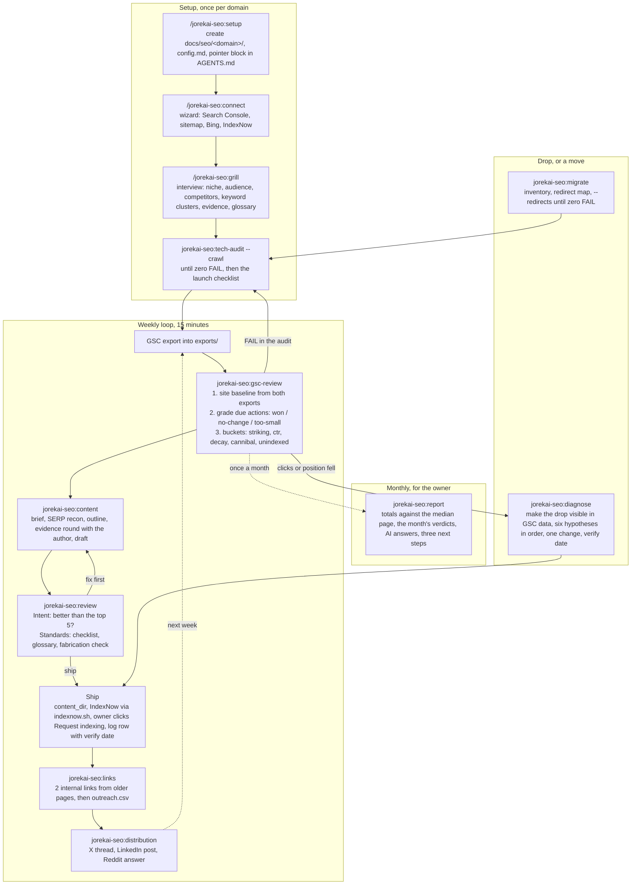
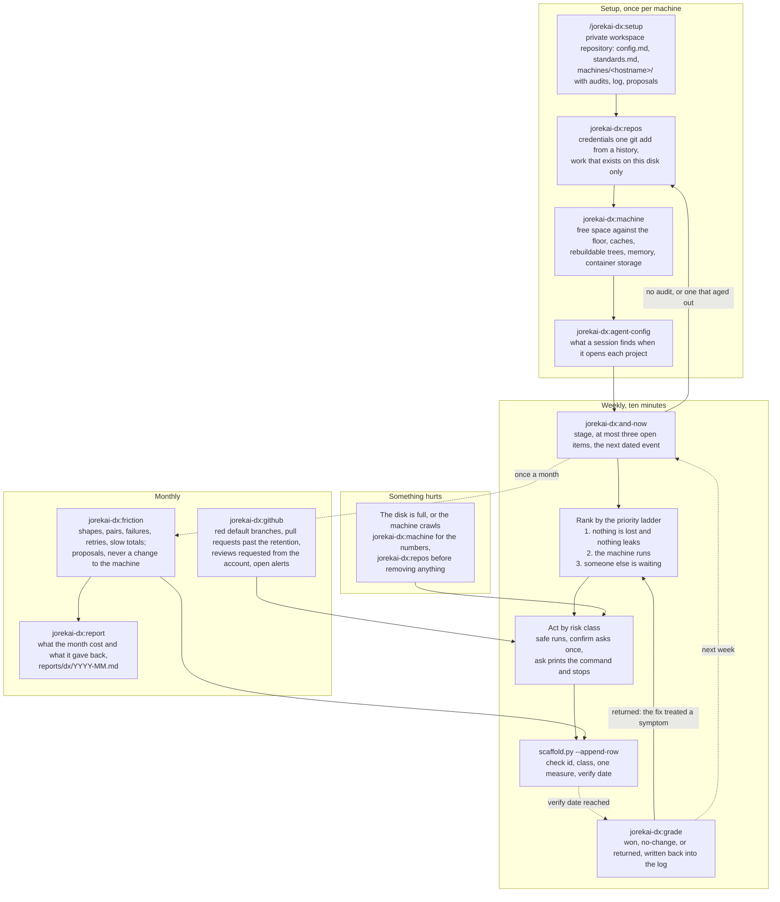
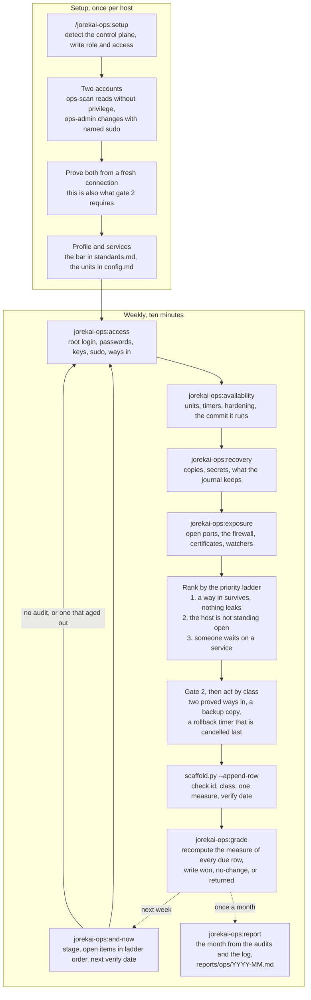
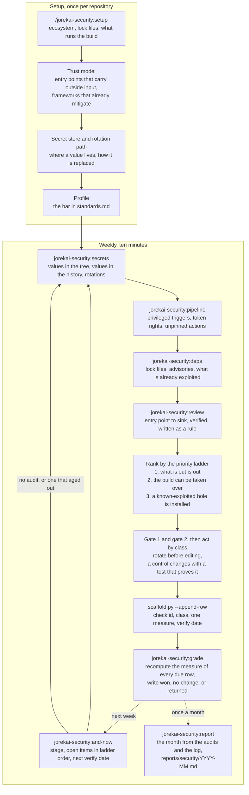
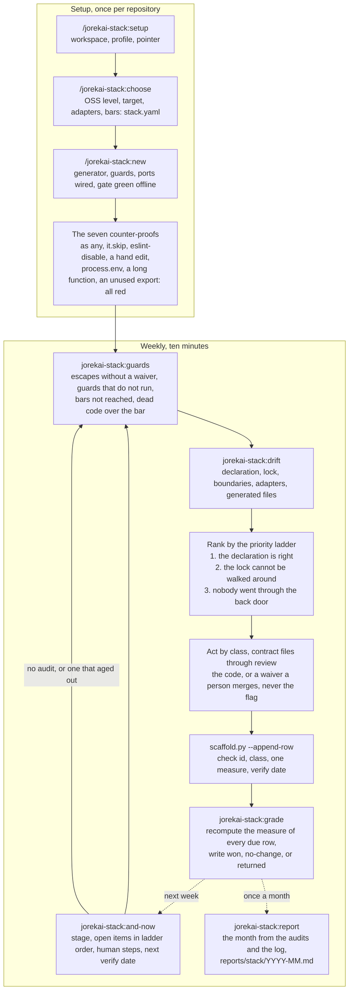

# skills

Hand-maintained skills for recurring work, one Claude Code plugin per theme. Install once, then the skills are slash commands in every repository:

```bash
claude plugin marketplace add jorekai/skills
claude plugin install jorekai-intro@jorekai    # the map: what is here and which part you need
claude plugin install jorekai-seo@jorekai      # search work on a site
claude plugin install jorekai-dx@jorekai       # the machine you work on
claude plugin install jorekai-ops@jorekai      # a host that serves
claude plugin install jorekai-security@jorekai # a code repository and its holes
claude plugin install jorekai-stack@jorekai    # a monorepo an agent cannot reach past
```

Install one, two, or all six; they share nothing at run time. Start with `/jorekai-intro:intro`, which draws the collection and names the one command to run next. Codex users link the same folders with `scripts/link.sh`, see "Use in a project".

This file is the map: one diagram per theme and one line per skill. What a skill measures, how it writes its answer, and why a rule exists stand in that theme's router, `skills/<theme>/<theme>/SKILL.md`.

## Structure

- One user-invoked router per theme, for example `/jorekai-seo:seo`, names the sub-skills, the flows, and the priorities. No context cost until it is called.
- User-invoked skills orchestrate; model-invoked skills hold the reusable discipline. Steps end on a completion criterion, reference material sits behind pointers, and tools appear only in `references/tools.md`.
- State lives with its subject, never in the skill. SEO writes `docs/seo/<domain>/` in the site's repository. DX and ops share one private workspace, one folder per machine and one log folder per theme. Security keeps a second, one folder per repository. Stack keeps a third, and its declaration `stack.yaml` lives in the generated repository because the project's tooling reads it (`decisions/0035`).
- Every change leaves a row in a weekly log with a measure and a verify date, and the commit that carries it out ends with a trailer naming the row. Every theme learns from the log, not from memory.
- A skill is a directory with `SKILL.md`, and optionally `references/`, `scripts/` (Python stdlib or bash), `templates/`, and `agents/openai.yaml` for Codex. Writing rules: `STYLE.md`. Reasons behind the rules: `decisions/`. Gate before every commit: `scripts/check.sh`. Contributions: `CONTRIBUTING.md`. License: MIT.

## Themes

| Theme | Plugin | Router | What it covers |
|---|---|---|---|
| `skills/seo/` | `jorekai-seo` | `/jorekai-seo:seo` | One site in search: indexing, what almost ranks, content, links, moves, monthly report |
| `skills/dx/` | `jorekai-dx` | `/jorekai-dx:dx` | One machine to work on: the workspace, the weekly sweep, and what to do next |
| `skills/ops/` | `jorekai-ops` | `/jorekai-ops:ops` | One host that serves: who can reach it, what runs on it, what may change, and whether the change held |
| `skills/security/` | `jorekai-security` | `/jorekai-security:security` | One code repository and its holes: what leaked, what can take over the build, what is installed that is known-bad, and where input reaches a dangerous sink |
| `skills/stack/` | `jorekai-stack` | `/jorekai-stack:stack` | One monorepo an agent cannot reach past: the declaration, the guards it generates, the escapes it counts, and whether the tree still matches |
| `skills/intro/` | `jorekai-intro` | `/jorekai-intro:intro` | The collection itself: every theme with its loop, every skill with who starts it and what it hands back |

## The map

`/jorekai-intro:intro` answers the question that comes before every other one here: what is in front of you, a site, the machine you work on, a host that serves, a repository, or a monorepo to create. It draws the themes and every skill, then hands over one install line and one start command. It measures nothing, keeps no workspace, and writes no log row (`decisions/0024`).

The map is generated from the collection itself and never typed. `skills/intro/intro/scripts/catalog.py` reads every skill header, each router's tables, and the manifests, and writes `references/catalog.json`. `catalog.py --check` runs in `scripts/check.sh`, so a skill added, renamed, or removed anywhere fails the gate until the map knows it.

| Skill | Invoked by | What it does |
|---|---|---|
| `jorekai-intro:intro` | user | Lists the themes, the skills, and the next command; `--json` feeds the page, `--theme` selects one, `--check` detects an outdated map |

## The SEO loop

Three phases: setup once per domain, the weekly loop for good, diagnosis only when something drops. Everything that changes the site leaves a row in the log, and the loop learns from the log rather than from memory.



| Skill | Invoked by | What it does |
|---|---|---|
| `jorekai-seo:seo` | user | Router: workspace, three flows, the priority ladder, the answer format per skill, launch checklist |
| `jorekai-seo:setup` | user | Creates `docs/seo/<domain>/` and the pointer block in the agent file; lists the log path, the next id, and what is due |
| `jorekai-seo:connect` | user | Walks the human through the clicks only a human can do: Search Console, sitemap, Bing, IndexNow |
| `jorekai-seo:grill` | user | Interviews for `strategy.md` and `glossary.md`: offer, audience, competitors, keyword clusters, evidence |
| `jorekai-seo:tech-audit` | model | Crawls a URL or a site and prescribes one fix per check id, full JSON in `audits/` |
| `jorekai-seo:gsc-review` | model | Turns two exports into the site baseline, the verdict on due actions, and six buckets of picks |
| `jorekai-seo:content` | model | Writes the brief and a draft with evidence slots, one page for one intent |
| `jorekai-seo:review` | model | Two separate verdicts on a draft, one for intent against the top five, one for the standards |
| `jorekai-seo:links` | model | Internal links from older pages first, then `outreach.csv` with a reason per target |
| `jorekai-seo:distribution` | model | An X thread, a LinkedIn post, and a Reddit answer from one published URL |
| `jorekai-seo:diagnose` | model | Confirms the drop in the export, then six hypotheses in order, one change, one verify date |
| `jorekai-seo:migrate` | model | Inventory of the old URLs, `redirect-map.csv`, then every redirect checked until zero FAIL |
| `jorekai-seo:report` | user | The month from the exports and the log, `reports/YYYY-MM.md` |
| `jorekai-seo:and-now` | user | Stage, due dates, drafts not shipped, and the next skill to call, from the workspace files |

The log is `docs/seo/<domain>/log/2026-W36.md`, one file per week. Every action carries a bucket, a status, the metric it started from, and a verify date: 14 days for a title or a meta, 28 days for content, links, and diagnosis. Details, and the answer format per skill: `skills/seo/seo/SKILL.md`.

## The DX loop

Setup once per machine, then a short weekly pass for good. Monthly, two further passes ask what the command history and the forge say. The workspace is a private repository of its own, because the subject is the machine: a finding like "four repositories hold unpushed commits" belongs to none of the four.



| Skill | Invoked by | What it does |
|---|---|---|
| `jorekai-dx:dx` | user | Router: workspace, flows, the priority ladder, the answer format per skill, the risk classes |
| `jorekai-dx:setup` | user | Creates the private workspace and the machine folder; appends a log row, lists what is due |
| `jorekai-dx:and-now` | user | Stage, due rows, and open findings from the workspace files, no machine access and no network |
| `jorekai-dx:repos` | model | Every local repository in one pass: credential files, unpushed work, lock drift, missing checks |
| `jorekai-dx:machine` | model | Free space against the floor, caches, rebuildable trees, memory; measures only, removes nothing |
| `jorekai-dx:github` | model | Failed runs on default branches, stale pull requests, requested reviews, alerts, open branches |
| `jorekai-dx:agent-config` | model | What a session finds when it opens each project: pointer file, permissions, hooks, servers |
| `jorekai-dx:grade` | model | One verdict per due log row, recomputed from the newest audit of the tool that found it |
| `jorekai-dx:friction` | user | Command shapes, pairs, failures, retries, slow totals; writes proposals, never a change |
| `jorekai-dx:report` | user | The month from the audits and the log, `reports/dx/YYYY-MM.md` |

The log is `machines/<hostname>/log/2026-W36.md`, one file per week. Every row carries a check id, the risk class it ran under, one measure with its unit, and a verify date; a commit that carries an action out ends with `DX-Log: <row id>`. Anything without a measure a script can recompute goes to `proposals/` instead. What each id means, its fix, and its class: `skills/dx/dx/references/fixes.md`.

## The ops loop

Setup once per host, then a short weekly pass. The order inside setup is not a preference: the connection that would repair a mistake in ssh, the firewall, or sudo is the connection the mistake closes, so the second way in exists before anything hardens the first.



| Skill | Invoked by | What it does |
|---|---|---|
| `jorekai-ops:ops` | user | Router: workspace, flows, the priority ladder, a fix per control plane, the two gates |
| `jorekai-ops:setup` | user | Creates the host folder and the two accounts; `remote.sh` runs a reading script over ssh |
| `jorekai-ops:and-now` | user | Stage, due rows, and open items from the workspace files, no host access and no network |
| `jorekai-ops:access` | model | Root login, passwords, weak algorithms, keys, sudo, and how many independent ways in exist |
| `jorekai-ops:availability` | model | Units down or failed, timers, required options, and the commit a deploy path runs |
| `jorekai-ops:exposure` | model | Ports open to anywhere, the firewall, certificates, and the units that watch failed attempts |
| `jorekai-ops:recovery` | model | Backup copies, secret files, credentials passed to a unit, and the two bounds on the journal |
| `jorekai-ops:grade` | model | One verdict per due log row, recomputed from the newest audit of the tool that found it |
| `jorekai-ops:report` | user | The month from the audits and the log, `reports/ops/YYYY-MM.md` |

The log is `machines/<hostname>/log/ops/2026-W36.md`, one folder per theme in the workspace DX keeps; the trailer is `Ops-Log: <row id>`. Above the three risk classes sit two gates. Nothing destructive runs against a repository holding uncommitted or unpushed work. And every change under `ssh.*`, `key.*`, `fw.*`, `sudo.*`, or `user.*` first proves two independent ways in from fresh connections, writes a backup copy, and arms a rollback timer that is cancelled only after a new connection succeeds (`decisions/0016`). Details: `skills/ops/ops/references/risk-classes.md`.

## The security loop

Setup once per repository, then a short weekly pass. Setup writes a trust model, and every later pass reads it: the entry points where outside input arrives, and what already escapes, binds, or authorises. A model finds a flaw once, so every accepted finding is written as a rule the script finds again in three weeks; a finding that earns no rule earns no row (`decisions/0026`).



| Skill | Invoked by | What it does |
|---|---|---|
| `jorekai-security:security` | user | Router: workspace, flows, the priority ladder, what the theme does not do, the two gates |
| `jorekai-security:setup` | user | Creates the repository folder and the trust model every later pass reads |
| `jorekai-security:and-now` | user | Stage, due rows, and open items from the workspace files, no repository read and no network |
| `jorekai-security:secrets` | model | Credentials in the tree and in the history; a fingerprint and a place per finding, never a value |
| `jorekai-security:pipeline` | model | Privileged triggers, interpolated shell steps, workflows with no rights named, actions on a tag |
| `jorekai-security:deps` | model | Installed versions against advisories and exploited flaws, and manifests without a lock file |
| `jorekai-security:review` | model | Traces outside input from an entry point to a sink, verifies it, and writes it as a rule |
| `jorekai-security:grade` | model | One verdict per due log row, recomputed from the newest audit of the tool that found it |
| `jorekai-security:report` | user | The month from the audits and the log, `reports/security/YYYY-MM.md` |

The log is `repos/<slug>/log/security/2026-W37.md` in a private workspace of this theme's own; the trailer is `Security-Log: <row id>`. Two gates sit above the risk classes. Every finding under `cred.*` is rotated at the provider before anything in the repository is touched. And every change to authentication, authorization, sessions, cryptography, or token rights carries a test that fails before it and passes after it, in the same commit (`decisions/0027`).

## The stack loop

The sixth theme is the first that creates something. Setup once per repository, then two axes written as a declaration, then a generator lays the guards over the official app generator's tree. The weekly pass asks two questions the other themes never ask: do the guards still stand, and did anybody walk around one.

The design rests on four sentences. A suppression is red unless a waiver names it with file, line, reason, owner, and a date. The agent grants itself nothing, because `stack.yaml` and every contract file stand under `CODEOWNERS`, so a waiver or a raised bar is a review. The server is the truth: a local hook is comfort, the required check on the default branch is the lock, and `escape.unenforced` measures the gap. And a project's own bans are first class: one rule file per ban with an id, a message naming the allowed state, and a test that proves it fires. Reasons: `decisions/0036`, `decisions/0037`.



| Skill | Invoked by | What it does |
|---|---|---|
| `jorekai-stack:stack` | user | Router: the four sentences, workspace, flows, the priority ladder, what the theme does not do |
| `jorekai-stack:setup` | user | Creates the repository folder in this theme's own workspace, with a profile and a snapshot |
| `jorekai-stack:choose` | user | Resolves the two axes to eight adapters and ten bars, written as `stack.yaml` |
| `jorekai-stack:new` | user | Lays the guards over the generator's tree, wires one adapter per port, adopts a repository |
| `jorekai-stack:and-now` | user | Stage, due rows, and open items from the workspace files, no repository read and no network |
| `jorekai-stack:guards` | model | Suppressions without a waiver, guards that do not run or that nothing enforces, bars not reached |
| `jorekai-stack:drift` | model | Declaration, lock, boundaries, adapters, and generated files changed by hand |
| `jorekai-stack:grade` | model | One verdict per due log row, recomputed from the newest audit of the tool that found it |
| `jorekai-stack:report` | user | The month from the audits and the log, `reports/stack/YYYY-MM.md` |

The log is `repos/<slug>/log/stack/2026-W37.md` in a third private workspace; the trailer is `Stack-Log: <row id>`. Every change to a contract file, which is `stack.yaml`, `CODEOWNERS`, the rules, the gate script, the hooks, the workflows, and the configurations that carry a bar, is a branch under review by a person who is not the agent. The failure mode is not a loud break, it is a bar that quietly moved.

The weekly workflow `.github/workflows/scaffold.yml` runs the real generator, a real install, and the real gate for every pair of the two axes, two of them again under the `strict` profile, then the seven counter-proofs and a fresh clone. `scripts/check.sh` stays offline and proves the templates; the workflow proves that the world still matches them.

## Use in a project

The collection is a Claude Code plugin, marketplace `jorekai` in `.claude-plugin/marketplace.json`. Installed once at user scope, every skill is available in every repository as `/jorekai-<theme>:<name>`, with autocomplete after `/jorekai-`. The install is a copy under `~/.claude/plugins/cache/jorekai/`, not a link: after editing a theme, bump `version` in that plugin's manifest, run `claude plugin marketplace update jorekai` and `claude plugin update <plugin>@jorekai`, then start a new session.

Codex reads `<repo>/.agents/skills/<name>/`; the link script fills that folder:

```bash
scripts/link.sh <repo>            # every skill of every theme
scripts/link.sh <repo> seo        # one theme (skills/seo/*)
scripts/link.sh <repo> setup      # named skills, globs allowed
```

A link is named `<theme>-<skill>`, the same pair as the plugin invocation, so `$seo-setup` and `$dx-setup` do not collide. A theme whose only skill carries the theme's own name links as `<theme>`, so the map is `$intro`.

The SEO workspace belongs in the site's repository. A site that lives in no repository gets a small private repository of its own that holds only `docs/seo/`, the pointer block, and the Codex links. The other four workspaces are private repositories of their own. This collection is public and carries no workspace, key, id, or customer data.

## Maintenance

The full rules for editing are in `AGENTS.md`, which every agent reads, and `STYLE.md`, which it points to. The short form:

- `bash scripts/check.sh` before every commit: style, private data, then every offline test and syntax check. It prints `ok` or one line per hit. Customer names to reject live in `.check_public.local`, gitignored, one regex per line.
- The router must not lie. Adding, renaming, or changing a sub-skill updates that theme's router, the table above, and that plugin's version with an entry at the top of its changelog, in the same commit. The gate fails on any of the three.
- The map must not lie either, and nobody edits it by hand. After a change to any skill, regenerate `skills/intro/intro/references/catalog.json` with `catalog.py --scan .` in the same commit.
- A platform claim carries a row in that theme's `references/sources.md` with a URL and a check date. Unverified means labelled as a heuristic, or left out. `python3 scripts/sources_age.py` lists rows older than 180 days; settle them once a quarter.
- Every measure counts a cost, as one number and one unit, so lower is better and zero means the finding is gone. A measurement that could not be taken is `null` and keeps the row open (`decisions/0030`).
