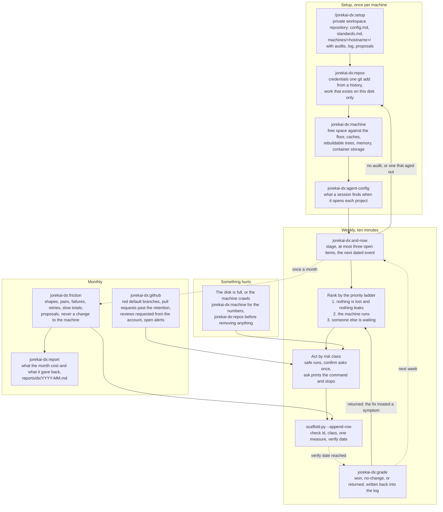

# jorekai-dx

One machine to work on: the workspace, the weekly sweep, and what to do next. Part of the [jorekai skills](../../README.md) collection.

```bash
claude plugin install jorekai-dx@jorekai
```

Start with `/jorekai-dx:setup` on a new machine, or with `/jorekai-dx:and-now` on a machine that has a workspace.

## The loop

Setup once per machine, then a short weekly pass for good. Monthly, two further passes ask what the command history and the forge say. The workspace is a private repository of its own, because the subject is the machine: a finding like "four repositories hold unpushed commits" belongs to none of the four.



## Skills

| Skill | Invoked by | What it does |
|---|---|---|
| [`jorekai-dx:dx`](dx/SKILL.md) | user | Router: workspace, flows, the priority ladder, the answer format per skill, the risk classes |
| [`jorekai-dx:setup`](setup/SKILL.md) | user | Creates the private workspace and the machine folder; appends a log row, lists what is due |
| [`jorekai-dx:and-now`](and-now/SKILL.md) | user | Stage, due rows, and open findings from the workspace files, no machine access and no network |
| [`jorekai-dx:repos`](repos/SKILL.md) | model | Every local repository in one pass: credential files, unpushed work, lock drift, missing checks |
| [`jorekai-dx:machine`](machine/SKILL.md) | model | Free space against the floor, caches, rebuildable trees, memory; measures only, removes nothing |
| [`jorekai-dx:github`](github/SKILL.md) | model | Failed runs on default branches, stale pull requests, requested reviews, alerts, open branches |
| [`jorekai-dx:agent-config`](agent-config/SKILL.md) | model | What a session finds when it opens each project: pointer file, permissions, hooks, servers |
| [`jorekai-dx:grade`](grade/SKILL.md) | model | One verdict per due log row, recomputed from the newest audit of the tool that found it |
| [`jorekai-dx:friction`](friction/SKILL.md) | user | Command shapes, pairs, failures, retries, slow totals; writes proposals, never a change |
| [`jorekai-dx:report`](report/SKILL.md) | user | The month from the audits and the log, `reports/dx/YYYY-MM.md` |

## Workspace and log

The workspace is a private repository per person, shared with the ops theme: one folder per machine under `machines/<hostname>/`, one log folder per theme (`decisions/0015`).

The log is `machines/<hostname>/log/dx/2026-W36.md`, one file per week. Every row carries a check id, the risk class it ran under, one measure with its unit, and a verify date. A commit that carries an action out ends with `DX-Log: <row id>`. Anything without a measure a script can recompute goes to `proposals/` instead.

## Read next

- [The router](dx/SKILL.md): flows, the priority ladder, and the answer format per skill.
- [Fixes](dx/references/fixes.md): what each check id means, its fix, its class, and its measure.
- [Risk classes](dx/references/risk-classes.md) and [sources](dx/references/sources.md).
- [Changelog](CHANGELOG.md).
