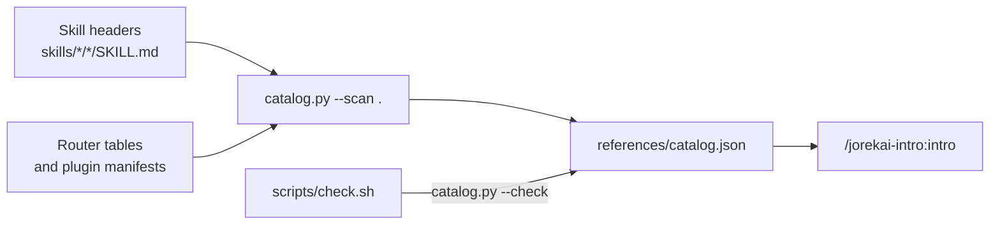

# jorekai-intro

The collection itself: every theme with its loop, every skill with who starts it and what it hands back. Part of the [jorekai skills](../../README.md) collection.

```bash
claude plugin install jorekai-intro@jorekai
```

Start with `/jorekai-intro:intro`.

## What it does

`/jorekai-intro:intro` answers the question that comes before every other one here: what is in front of you, a site, the machine you work on, a host that serves, a repository, or a monorepo to create. It draws the themes and every skill, then hands over one install line and one start command.

It measures nothing, keeps no workspace, and writes no log row (`decisions/0024`).

## How the map stays true

Nobody types the map. It is generated from the collection itself:



`catalog.py --check` runs in `scripts/check.sh`, so a skill added, renamed, or removed anywhere fails the gate until the map knows it.

## Skills

| Skill | Invoked by | What it does |
|---|---|---|
| [`jorekai-intro:intro`](intro/SKILL.md) | user | Lists the themes, the skills, and the next command; `--json` feeds the page, `--theme` selects one, `--check` detects an outdated map |

## Read next

- [The skill](intro/SKILL.md) and [the generator](intro/scripts/catalog.py).
- [Changelog](CHANGELOG.md).
