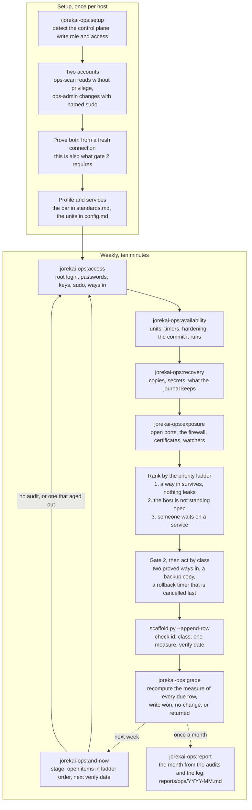

# jorekai-ops

One host that serves: who can reach it, what runs on it, what may change, and whether the change held. Part of the [jorekai skills](../../README.md) collection.

```bash
claude plugin install jorekai-ops@jorekai
```

Start with `/jorekai-ops:setup` on a new host, or with `/jorekai-ops:and-now` on a host that has a folder in the workspace.

## The loop

Setup once per host, then a short weekly pass. The order inside setup is not a preference: the connection that would repair a mistake in ssh, the firewall, or sudo is the connection the mistake closes, so the second way in exists before anything hardens the first.



## Skills

| Skill | Invoked by | What it does |
|---|---|---|
| [`jorekai-ops:ops`](ops/SKILL.md) | user | Router: workspace, flows, the priority ladder, a fix per control plane, the two gates |
| [`jorekai-ops:setup`](setup/SKILL.md) | user | Creates the host folder and the two accounts; `remote.sh` runs a reading script over ssh |
| [`jorekai-ops:and-now`](and-now/SKILL.md) | user | Stage, due rows, and open items from the workspace files, no host access and no network |
| [`jorekai-ops:access`](access/SKILL.md) | model | Root login, passwords, weak algorithms, keys, sudo, and how many independent ways in exist |
| [`jorekai-ops:availability`](availability/SKILL.md) | model | Units down or failed, timers, required options, and the commit a deploy path runs |
| [`jorekai-ops:exposure`](exposure/SKILL.md) | model | Ports open to anywhere, the firewall, certificates, and the units that watch failed attempts |
| [`jorekai-ops:recovery`](recovery/SKILL.md) | model | Backup copies, secret files, credentials passed to a unit, and the two bounds on the journal |
| [`jorekai-ops:grade`](grade/SKILL.md) | model | One verdict per due log row, recomputed from the newest audit of the tool that found it |
| [`jorekai-ops:report`](report/SKILL.md) | user | The month from the audits and the log, `reports/ops/YYYY-MM.md` |

## Workspace and log

The workspace is the one the dx theme keeps: one folder per host under `machines/<hostname>/`, one log folder per theme (`decisions/0015`).

The log is `machines/<hostname>/log/ops/2026-W36.md`; the trailer is `Ops-Log: <row id>`. Above the three risk classes sit two gates:

1. Nothing destructive runs against a repository holding uncommitted or unpushed work.
2. Every change under `ssh.*`, `key.*`, `fw.*`, `sudo.*`, or `user.*` first proves two independent ways in from fresh connections, writes a backup copy, and arms a rollback timer that is cancelled only after a new connection succeeds (`decisions/0016`).

## Read next

- [The router](ops/SKILL.md): flows, the priority ladder, and a fix per control plane.
- [Fixes](ops/references/fixes.md): what each check id means, its fix, its class, and its measure.
- [Risk classes and the two gates](ops/references/risk-classes.md), and [sources](ops/references/sources.md).
- [Changelog](CHANGELOG.md).
