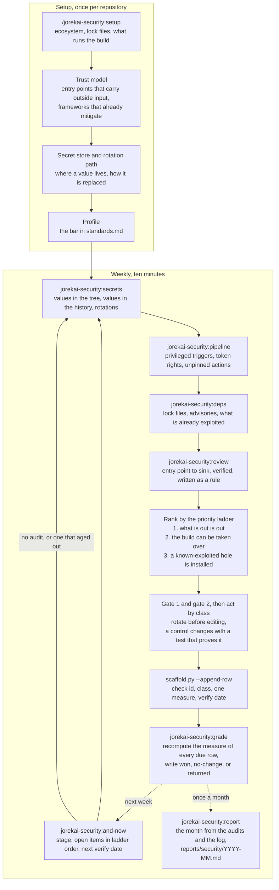

# jorekai-security

One code repository and its holes: what leaked, what can take over the build, what is installed that is known-bad, and where input reaches a dangerous sink. Part of the [jorekai skills](../../README.md) collection.

```bash
claude plugin install jorekai-security@jorekai
```

Start with `/jorekai-security:setup` on a new repository, or with `/jorekai-security:and-now` on one that has a folder in the workspace.

## The loop

Setup once per repository, then a short weekly pass. Setup writes a trust model, and every later pass reads it: the entry points where outside input arrives, and what already escapes, binds, or authorises. A model finds a flaw once, so every accepted finding is written as a rule the script finds again in three weeks; a finding that earns no rule earns no row (`decisions/0026`).



## Skills

| Skill | Invoked by | What it does |
|---|---|---|
| [`jorekai-security:security`](security/SKILL.md) | user | Router: workspace, flows, the priority ladder, what the theme does not do, the two gates |
| [`jorekai-security:setup`](setup/SKILL.md) | user | Creates the repository folder and the trust model every later pass reads |
| [`jorekai-security:and-now`](and-now/SKILL.md) | user | Stage, due rows, and open items from the workspace files, no repository read and no network |
| [`jorekai-security:secrets`](secrets/SKILL.md) | model | Credentials in the tree and in the history; a fingerprint and a place per finding, never a value |
| [`jorekai-security:pipeline`](pipeline/SKILL.md) | model | Privileged triggers, interpolated shell steps, workflows with no rights named, actions on a tag |
| [`jorekai-security:deps`](deps/SKILL.md) | model | Installed versions against advisories and exploited flaws, and manifests without a lock file |
| [`jorekai-security:review`](review/SKILL.md) | model | Traces outside input from an entry point to a sink, verifies it, and writes it as a rule |
| [`jorekai-security:grade`](grade/SKILL.md) | model | One verdict per due log row, recomputed from the newest audit of the tool that found it |
| [`jorekai-security:report`](report/SKILL.md) | user | The month from the audits and the log, `reports/security/YYYY-MM.md` |

## Workspace and log

The workspace is a private repository of this theme's own, one folder per repository under `repos/<slug>/` (`decisions/0025`). A repository is not a machine, so it does not share the dx workspace.

The log is `repos/<slug>/log/security/2026-W37.md`; the trailer is `Security-Log: <row id>`. Two gates sit above the risk classes (`decisions/0027`):

1. Every finding under `cred.*` is rotated at the provider before anything in the repository is touched.
2. Every change to authentication, authorization, sessions, cryptography, or token rights carries a test that fails before it and passes after it, in the same commit.

## Read next

- [The router](security/SKILL.md): flows, the priority ladder, and what the theme does not do.
- [Fixes](security/references/fixes.md): what each check id means, its fix, its class, and its measure.
- [Risk classes and the two gates](security/references/risk-classes.md), and [sources](security/references/sources.md).
- [Changelog](CHANGELOG.md).
