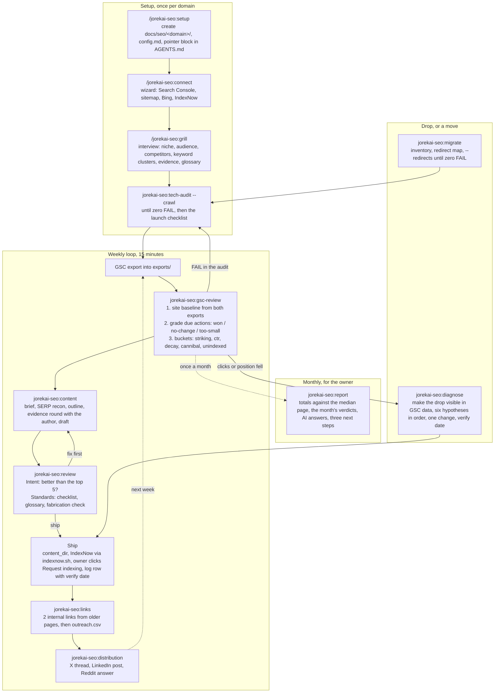

# jorekai-seo

One site in search: indexing, what almost ranks, content, links, moves, and a monthly report. Part of the [jorekai skills](../../README.md) collection.

```bash
claude plugin install jorekai-seo@jorekai
```

Start with `/jorekai-seo:setup` on a new site, or with `/jorekai-seo:and-now` on a site that has a workspace.

## The loop

Three phases: setup once per domain, the weekly loop for good, diagnosis only when something drops. Everything that changes the site leaves a row in the log, and the loop learns from the log rather than from memory.



## Skills

| Skill | Invoked by | What it does |
|---|---|---|
| [`jorekai-seo:seo`](seo/SKILL.md) | user | Router: workspace, three flows, the priority ladder, the answer format per skill, launch checklist |
| [`jorekai-seo:setup`](setup/SKILL.md) | user | Creates `docs/seo/<domain>/` and the pointer block in the agent file; lists the log path, the next id, and what is due |
| [`jorekai-seo:connect`](connect/SKILL.md) | user | Walks the human through the clicks only a human can do: Search Console, sitemap, Bing, IndexNow |
| [`jorekai-seo:grill`](grill/SKILL.md) | user | Interviews for `strategy.md` and `glossary.md`: offer, audience, competitors, keyword clusters, evidence |
| [`jorekai-seo:tech-audit`](tech-audit/SKILL.md) | model | Crawls a URL or a site and prescribes one fix per check id, full JSON in `audits/` |
| [`jorekai-seo:gsc-review`](gsc-review/SKILL.md) | model | Turns two exports into the site baseline, the verdict on due actions, and six buckets of picks |
| [`jorekai-seo:content`](content/SKILL.md) | model | Writes the brief and a draft with evidence slots, one page for one intent |
| [`jorekai-seo:review`](review/SKILL.md) | model | Two separate verdicts on a draft, one for intent against the top five, one for the standards |
| [`jorekai-seo:links`](links/SKILL.md) | model | Internal links from older pages first, then `outreach.csv` with a reason per target |
| [`jorekai-seo:distribution`](distribution/SKILL.md) | model | An X thread, a LinkedIn post, and a Reddit answer from one published URL |
| [`jorekai-seo:diagnose`](diagnose/SKILL.md) | model | Confirms the drop in the export, then six hypotheses in order, one change, one verify date |
| [`jorekai-seo:migrate`](migrate/SKILL.md) | model | Inventory of the old URLs, `redirect-map.csv`, then every redirect checked until zero FAIL |
| [`jorekai-seo:report`](report/SKILL.md) | user | The month from the exports and the log, `reports/YYYY-MM.md` |
| [`jorekai-seo:and-now`](and-now/SKILL.md) | user | Stage, due dates, drafts not shipped, and the next skill to call, from the workspace files |

## Workspace and log

The workspace is `docs/seo/<domain>/` in the site's own repository. A site that lives in no repository gets a small private repository that holds only `docs/seo/`, the pointer block, and the Codex links.

The log is `docs/seo/<domain>/log/2026-W36.md`, one file per week. Every action carries a bucket, a status, the metric it started from, and a verify date: 14 days for a title or a meta, 28 days for content, links, and diagnosis. The commit that makes the change ends with the trailer `SEO-Log: <row id>`.

## Read next

- [The router](seo/SKILL.md): flows, the priority ladder, and the answer format per skill.
- [Launch checklist](seo/references/launch-checklist.md) and [sources](seo/references/sources.md) for every platform claim.
- [Changelog](../../CHANGELOG.md): this plugin's version lives at the repository root.
