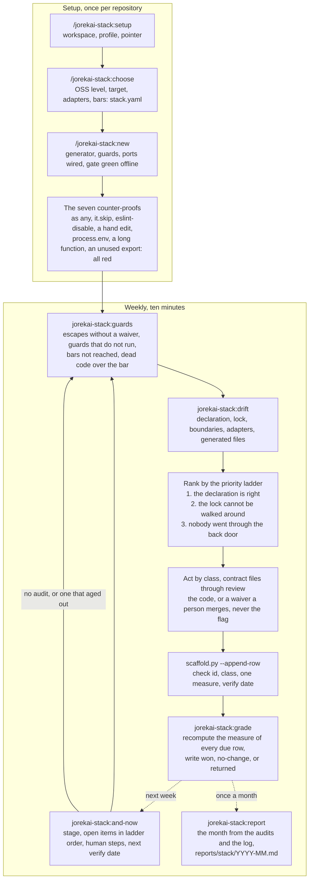

# jorekai-stack

One monorepo an agent cannot reach past: the declaration, the guards it generates, the escapes it counts, and whether the tree still matches. Part of the [jorekai skills](../../README.md) collection.

```bash
claude plugin install jorekai-stack@jorekai
```

Start with `/jorekai-stack:setup` for a new or adopted repository, or with `/jorekai-stack:and-now` on one that has a folder in the workspace.

## The idea in four sentences

This is the first theme that creates something. The design rests on four sentences:

1. A suppression is red unless a waiver names it with file, line, reason, owner, and a date.
2. The agent grants itself nothing: `stack.yaml` and every contract file stand under `CODEOWNERS`, so a waiver or a raised bar is a review.
3. The server is the truth: a local hook is comfort, the required check on the default branch is the lock, and `escape.unenforced` measures the gap.
4. A project's own bans are first class: one rule file per ban with an id, a message naming the allowed state, and a test that proves it fires.

Reasons: `decisions/0036`, `decisions/0037`.

## The loop

Setup once per repository, then two axes written as a declaration, then a generator lays the guards over the official app generator's tree. The weekly pass asks two questions the other themes never ask: do the guards still stand, and did anybody walk around one.



## Skills

| Skill | Invoked by | What it does |
|---|---|---|
| [`jorekai-stack:stack`](stack/SKILL.md) | user | Router: the four sentences, workspace, flows, the priority ladder, what the theme does not do |
| [`jorekai-stack:setup`](setup/SKILL.md) | user | Creates the repository folder in this theme's own workspace, with a profile and a snapshot |
| [`jorekai-stack:choose`](choose/SKILL.md) | user | Resolves the two axes to eight adapters and ten bars, written as `stack.yaml` |
| [`jorekai-stack:new`](new/SKILL.md) | user | Lays the guards over the generator's tree, wires one adapter per port, adopts a repository |
| [`jorekai-stack:and-now`](and-now/SKILL.md) | user | Stage, due rows, and open items from the workspace files, no repository read and no network |
| [`jorekai-stack:guards`](guards/SKILL.md) | model | Suppressions without a waiver, guards that do not run or that nothing enforces, bars not reached |
| [`jorekai-stack:drift`](drift/SKILL.md) | model | Declaration, lock, boundaries, adapters, and generated files changed by hand |
| [`jorekai-stack:grade`](grade/SKILL.md) | model | One verdict per due log row, recomputed from the newest audit of the tool that found it |
| [`jorekai-stack:report`](report/SKILL.md) | user | The month from the audits and the log, `reports/stack/YYYY-MM.md` |

## Workspace and log

The declaration `stack.yaml` lives in the generated repository, because the project's tooling reads it. The findings live in a third private workspace, `~/stack`, one folder per repository under `repos/<slug>/` (`decisions/0035`).

The log is `repos/<slug>/log/stack/2026-W37.md`; the trailer is `Stack-Log: <row id>`. Every change to a contract file is a branch under review by a person who is not the agent. Contract files are `stack.yaml`, `CODEOWNERS`, the rules, the gate script, the hooks, the workflows, and the configurations that carry a bar. The failure mode is not a loud break, it is a bar that quietly moved.

## Proof against the real world

`scripts/check.sh` stays offline and proves the templates. The weekly workflow `.github/workflows/scaffold.yml` proves that the world still matches them: it runs the real generator, a real install, and the real gate for every pair of the two axes, two of them again under the `strict` profile, then the seven counter-proofs and a fresh clone.

## Read next

- [The router](stack/SKILL.md): flows, the priority ladder, and what the theme does not do.
- [Declaration](stack/references/declaration.md), [contracts](stack/references/contracts.md), [ports](stack/references/ports.md), and [rules](stack/references/rules.md).
- [Fixes](stack/references/fixes.md): what each check id means, its fix, its class, and its measure.
- [Changelog](CHANGELOG.md).
